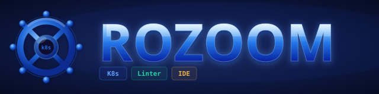

<p align="center">
  
</p>

<p align="center">
  <strong>A Swiss Army Knife for Kubernetes</strong> - an all-in-one fleet IDE that gives platform engineers and DevOps teams complete visibility and control over their clusters.
</p>

<p align="center">
  Built with <strong>Tauri</strong> and <strong>SvelteKit</strong>, ROZOOM combines real-time runtime health signals with configuration risk scoring in a single cross-platform desktop app.
</p>

---

## Repository Structure

```text
.
├── dashboard-app/        # Tauri + SvelteKit desktop application
└── README.md             # Repository overview (this file)
```

The primary application lives in `dashboard-app/`. See the detailed developer guide there for local development, build, and release steps.

---

## What this project delivers

- **Runtime Health Score**: shows what is failing right now across control plane, nodes, workloads, observability, and platform hygiene.
- **Config Reliability & Security Score**: highlights configuration risks that can cause incidents.
- **Actionable remediation**: top issues are ranked by impact with minimal fix guidance.
- **Cross-platform desktop app**: Linux, macOS, Windows via Tauri.

---

## Getting Started

### 1) Install prerequisites

- Node.js ≥ 20
- pnpm
- Rust (stable)
- Tauri system dependencies (see https://tauri.app/v2/)

### 2) Run the app locally

```bash
cd dashboard-app
pnpm install
pnpm format
pnpm run check
pnpm vitest
pnpm download:binaries
pnpm tauri dev
```

For full developer documentation and build steps, read `dashboard-app/README.md`.

### Run unsigned application on macOS

After installing the DMG, macOS may quarantine the app. Remove the quarantine flag:

```bash
xattr -dr com.apple.quarantine /Applications/ROZOOM\ -\ K8s\ Linter\ IDE.app
```

---

## Contributing

We welcome contributions that improve cluster visibility, reliability scoring, and user experience.

### How to contribute

1. Fork the repository
2. Create a feature branch
3. Make your changes with tests and documentation
4. Submit a Pull Request with a clear description of impact

### Contribution focus areas

- New runtime health signals (API, etcd, node conditions, workloads)
- Config risk checks and scoring improvements
- UI/UX improvements to surface risk and remediation clarity
- Performance optimizations and request minimization

---

## Versioning

The desktop application follows **Semantic Versioning**.

- **MAJOR**: breaking changes in app behavior or configuration
- **MINOR**: new features or significant enhancements
- **PATCH**: fixes and small improvements

The current version is defined in:

- `dashboard-app/src-tauri/tauri.conf.json`
- `dashboard-app/src-tauri/Cargo.toml`

---

## License

The ROZOOM core is licensed under the Apache License 2.0. See [LICENSE](LICENSE) for details.

Marketplace plugins may be subject to their own license terms.

Copyright (c) 2024-2026 ceh13-community, Inc.

ROZOOM - K8s Linter IDE and the ROZOOM Logo are trademarks of ceh13-community, Inc.
